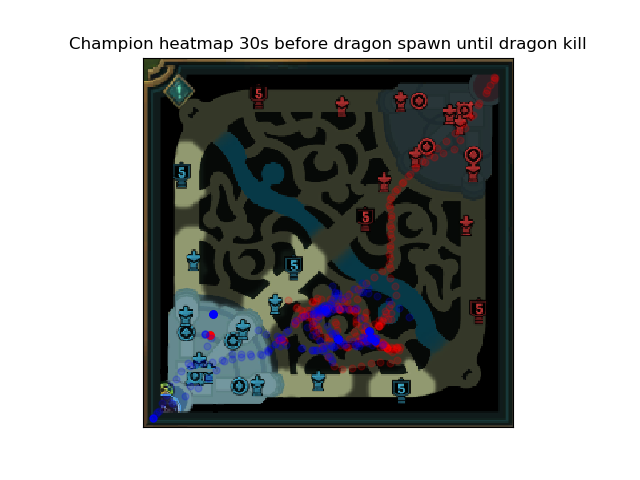

# League of Legends analytics
## Experience
I'm an experienced League of Legends player. I have held Diamond rank since Season 3 (inclusive) and was member in the highly successful team Bristol Whipped in the UK National Student Esports tournaments. BRW won in 2021, 2020 and got 2nd place in 2019 in the NUEL. I was the main roster support for 2019 and a sub for 2020.
I am also working as a software developer with an interest in data science and visualization.

This repo shows some of my work in exploring a dataset and creating a few example plots of what are possible to help guide strategic coaching decisions for proffessional teams.
Here is an example plot of champion positions 30s before a dragon spawn up to the dragon kill.
